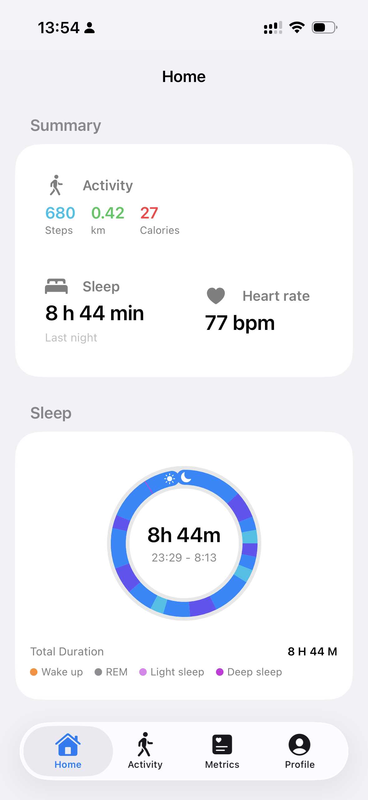
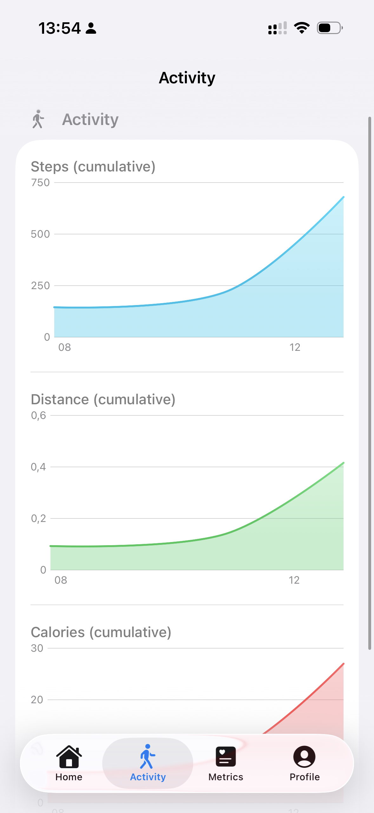
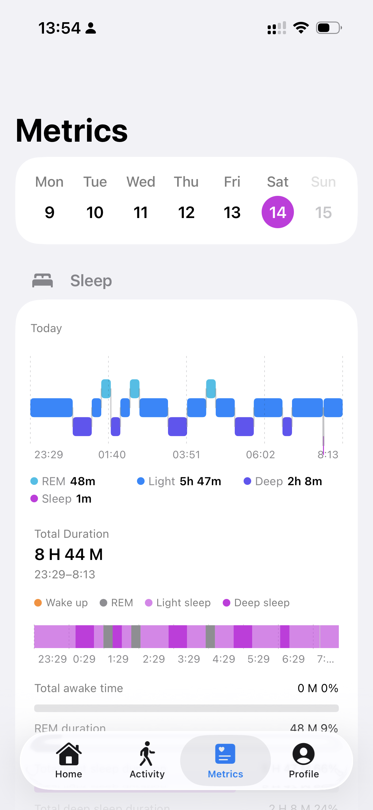
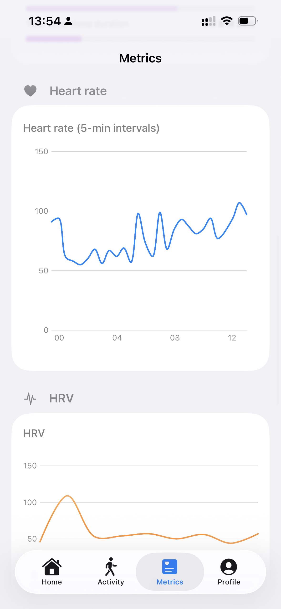
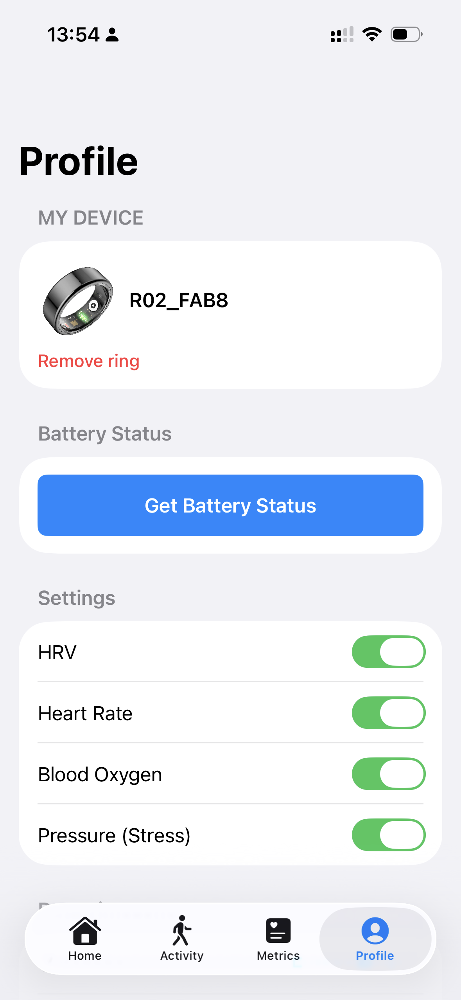

# Colmi Smart Ring

Open-source tools and app work for Colmi smart ring data, built around one simple idea:
**health should be accessible, transparent, and free.**

If this project is useful to you, please consider giving it a star. It helps more people discover it.

## Screenshots

| Home | Activity |
| --- | --- |
|  |  |

| Sleep Metrics | Heart Rate and HRV Metrics |
| --- | --- |
|  |  |

| Profile |
| --- |
|  |

## Why this project exists

Most wearable ecosystems are closed. This project aims to make ring data easier to access, inspect, and use in open workflows so people can learn from their own health data without paywalls.

## Open-source and free forever

This project is and will remain open source.
It stays free because health should not be locked behind expensive subscriptions.

## Benchmarking initiative

I am actively benchmarking this project against other smart rings and wearable devices to improve data quality, reliability, and comparisons across hardware.

This requires funding for test devices and validation work.

## Support the project (tips and sponsorships)

If you want to help accelerate benchmarking and development:

- Leave a tip via Bitcoin or the Lightning Network by scanning one of the QR codes below.

| Bitcoin | Lightning |
| --- | --- |
|  |  |

Every contribution goes back into keeping this project free and improving benchmark coverage.

## References

- Original reverse-engineering/client work: https://github.com/tahnok/colmi_r02_client/tree/9e08383f6315e3211395edc64e5097333f1a42a5
- Project background: https://huggingface.co/blog/cyrilzakka/halo-introduction
- API: https://colmi.puxtril.com
- Commands: https://github.com/CitizenOneX/colmi_r06_fbp/blob/main/lib/colmi_ring.dart